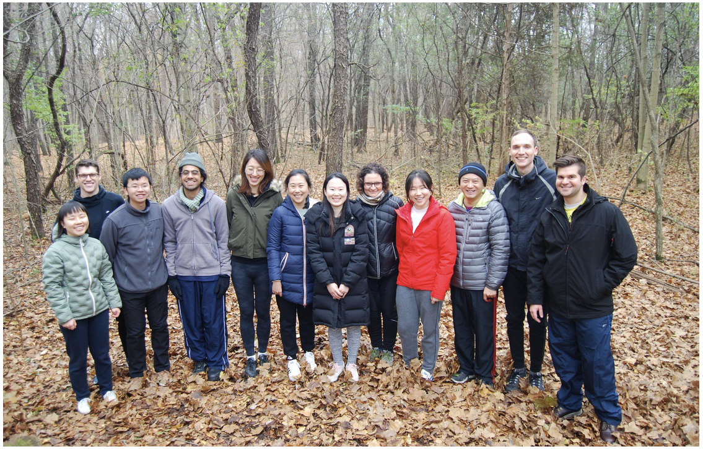

--- 
title: "The Ji and Liza Group Super Reading List"
date: "`r Sys.Date()`"
site: bookdown::bookdown_site
output: pdf_document
bibliography:
- book.bib
- packages.bib
description: |
  This is a minimal example of using the bookdown package to write a book.
  set in the _output.yml file.
  The HTML output format for this example is bookdown::gitbook,
link-citations: true
github-repo: "rstudio/bookdown-demo"
documentclass: book
---

# Welcome! {-}

``` {r out.width="80%", echo=FALSE, fig.align="center"}
knitr::include_graphics("images/Liza_Ji_One.png")
```

## Introduction {-}

Hello! This website was made for the Liza/Ji research group. It will primarily serve as a collection of works to help new students navigate the literature and get up to speed on the workings of the group. In each of the panels to the side, you will see a different topic. For each of these chapters, you will find a selection of works coupled with a brief snippet describing the significance of the paper and how it may pertain to the work of new students. We also try here to supply a narrative describing how each of the works fit into a larger picture. 

If you have questions, don't hesitate to reach out to Ji, Liza, or another member of the group. If you find anything on this website broken or lacking for any reason, don't hesitate to contact Chandler (chandle at umich dot edu). 

Have fun exploring!

## Group Expectations {-}


## Group Fun/Memories {-}


``` {r out.width="80%", echo=FALSE, fig.align="center"}

```

